# Data Model: WalkPaws Platform

**Date**: 2025-11-20
**Feature**: WalkPaws Platform Implementation
**Status**: Phase 1 Complete

## Entity Relationship Diagram

```mermaid
erDiagram
    users ||--o{ pets : "owns"
    users ||--o{ bookings : "requests"
    users ||--o{ bookings : "walks"
    users ||--o{ reviews : "writes"
    users ||--o{ notifications : "receives"
    users ||--o{ walker_profiles : "has"
    pets ||--o{ bookings : "booked_for"
    bookings ||--o{ reviews : "has_review"
    bookings ||--o{ walk_reports : "has_report"
    walker_profiles ||--o{ availability_slots : "has"
    availability_slots ||--o{ bookings : "booked_in"
```



## Core Entities

### users
Represents platform users (both dog owners and walkers)

```sql
CREATE TABLE users (
  id UUID PRIMARY KEY DEFAULT gen_random_uuid(),
  email TEXT UNIQUE NOT NULL,
  encrypted_password TEXT NOT NULL,
  user_type TEXT NOT NULL CHECK (user_type IN ('owner', 'walker', 'both')),
  first_name TEXT NOT NULL,
  last_name TEXT NOT NULL,
  phone_number TEXT,
  avatar_url TEXT,
  address_line1 TEXT,
  address_line2 TEXT,
  city TEXT,
  state TEXT,
  zip_code TEXT,
  country TEXT DEFAULT 'US',
  latitude DECIMAL(10, 8),
  longitude DECIMAL(11, 8),
  email_verified BOOLEAN DEFAULT FALSE,
  is_active BOOLEAN DEFAULT TRUE,
  created_at TIMESTAMP WITH TIME ZONE DEFAULT NOW(),
  updated_at TIMESTAMP WITH TIME ZONE DEFAULT NOW()
);
```

**Validation Rules**:
- Email must be valid format
- Phone number must be valid US format
- User type must be one of: 'owner', 'walker', 'both'
- Coordinates must be valid latitude/longitude pairs

### pets
Represents dogs owned by users

```sql
CREATE TABLE pets (
  id UUID PRIMARY KEY DEFAULT gen_random_uuid(),
  owner_id UUID NOT NULL REFERENCES users(id) ON DELETE CASCADE,
  name TEXT NOT NULL,
  breed TEXT NOT NULL,
  age_years INTEGER CHECK (age_years >= 0 AND age_years <= 30),
  age_months INTEGER CHECK (age_months >= 0 AND age_months <= 11),
  weight_pounds INTEGER CHECK (weight_pounds > 0 AND weight_pounds <= 300),
  gender TEXT CHECK (gender IN ('male', 'female')),
  is_spayed_neutered BOOLEAN,
  special_needs TEXT,
  vaccination_status TEXT CHECK (vaccination_status IN ('up_to_date', 'partial', 'none')),
  temperament TEXT CHECK (temperament IN ('calm', 'energetic', 'aggressive', 'shy', 'friendly')),
  walk_duration_preference TEXT CHECK (walk_duration_preference IN ('15_min', '30_min', '45_min', '60_min')),
  photo_urls TEXT[] DEFAULT '{}',
  is_active BOOLEAN DEFAULT TRUE,
  created_at TIMESTAMP WITH TIME ZONE DEFAULT NOW(),
  updated_at TIMESTAMP WITH TIME ZONE DEFAULT NOW()
);
```

**Validation Rules**:
- Age must be reasonable (0-30 years, 0-11 months)
- Weight must be positive and reasonable (1-300 lbs)
- At least one photo URL required for active pets
- Special needs description limited to 500 characters

### walker_profiles
Extended profile information for dog walkers

```sql
CREATE TABLE walker_profiles (
  id UUID PRIMARY KEY DEFAULT gen_random_uuid(),
  user_id UUID NOT NULL UNIQUE REFERENCES users(id) ON DELETE CASCADE,
  bio TEXT,
  experience_years INTEGER CHECK (experience_years >= 0),
  certifications TEXT[],
  services_offered TEXT[] CHECK (array_length(services_offered, 1) > 0),
  base_price_15min DECIMAL(10, 2) CHECK (base_price_15min > 0),
  base_price_30min DECIMAL(10, 2) CHECK (base_price_30min > 0),
  base_price_45min DECIMAL(10, 2) CHECK (base_price_45min > 0),
  base_price_60min DECIMAL(10, 2) CHECK (base_price_60min > 0),
  radius_miles INTEGER CHECK (radius_miles > 0 AND radius_miles <= 50),
  transportation TEXT CHECK (transportation IN ('walk', 'bike', 'car', 'public')),
  background_check_status TEXT CHECK (background_check_status IN ('pending', 'approved', 'rejected')),
  average_rating DECIMAL(3, 2) DEFAULT 0.00 CHECK (average_rating >= 0 AND average_rating <= 5),
  total_walks INTEGER DEFAULT 0,
  is_available BOOLEAN DEFAULT TRUE,
  document_urls TEXT[] DEFAULT '{}',
  created_at TIMESTAMP WITH TIME ZONE DEFAULT NOW(),
  updated_at TIMESTAMP WITH TIME ZONE DEFAULT NOW()
);
```

**Validation Rules**:
- Experience years must be non-negative
- At least one service must be offered
- All prices must be positive
- Radius limited to 50 miles maximum
- Rating must be between 0-5

### bookings
Represents walk booking requests and their status

```sql
CREATE TYPE booking_status AS ENUM ('pending', 'confirmed', 'in_progress', 'completed', 'cancelled', 'no_show');
CREATE TYPE walk_duration AS ENUM ('15_min', '30_min', '45_min', '60_min');

CREATE TABLE bookings (
  id UUID PRIMARY KEY DEFAULT gen_random_uuid(),
  owner_id UUID NOT NULL REFERENCES users(id) ON DELETE CASCADE,
  walker_id UUID REFERENCES users(id) ON DELETE SET NULL,
  pet_id UUID NOT NULL REFERENCES pets(id) ON DELETE CASCADE,
  status booking_status NOT NULL DEFAULT 'pending',
  scheduled_date DATE NOT NULL,
  scheduled_start_time TIME NOT NULL,
  duration walk_duration NOT NULL,
  special_instructions TEXT,
  pickup_location TEXT,
  dropoff_location TEXT,
  price DECIMAL(10, 2) NOT NULL CHECK (price > 0),
  service_fee DECIMAL(10, 2) NOT NULL CHECK (service_fee >= 0),
  total_price DECIMAL(10, 2) NOT NULL CHECK (total_price > 0),
  recurrence_pattern TEXT CHECK (recurrence_pattern IN ('once', 'weekly', 'bi_weekly', 'monthly')),
  recurrence_end_date DATE,
  parent_booking_id UUID REFERENCES bookings(id),
  created_at TIMESTAMP WITH TIME ZONE DEFAULT NOW(),
  updated_at TIMESTAMP WITH TIME ZONE DEFAULT NOW(),
  confirmed_at TIMESTAMP WITH TIME ZONE,
  started_at TIMESTAMP WITH TIME ZONE,
  completed_at TIMESTAMP WITH TIME ZONE,
  cancelled_at TIMESTAMP WITH TIME ZONE
);
```

**Validation Rules**:
- Scheduled date cannot be in the past
- Start time must be reasonable (6 AM - 10 PM)
- Recurrence end date must be after scheduled date
- Price calculations must be consistent
- Status transitions must follow valid workflow

### reviews
User reviews and ratings for completed walks

```sql
CREATE TABLE reviews (
  id UUID PRIMARY KEY DEFAULT gen_random_uuid(),
  booking_id UUID NOT NULL UNIQUE REFERENCES bookings(id) ON DELETE CASCADE,
  reviewer_id UUID NOT NULL REFERENCES users(id) ON DELETE CASCADE,
  reviewee_id UUID NOT NULL REFERENCES users(id) ON DELETE CASCADE,
  rating INTEGER NOT NULL CHECK (rating >= 1 AND rating <= 5),
  comment TEXT CHECK (length(comment) <= 1000),
  punctuality_rating INTEGER CHECK (punctuality_rating >= 1 AND punctuality_rating <= 5),
  communication_rating INTEGER CHECK (communication_rating >= 1 AND communication_rating <= 5),
  care_rating INTEGER CHECK (care_rating >= 1 AND care_rating <= 5),
  would_recommend BOOLEAN NOT NULL,
  created_at TIMESTAMP WITH TIME ZONE DEFAULT NOW(),
  updated_at TIMESTAMP WITH TIME ZONE DEFAULT NOW()
);
```

**Validation Rules**:
- Only completed bookings can be reviewed
- Reviewer must be either owner or walker of the booking
- All ratings must be between 1-5
- Comment limited to 1000 characters

### notifications
System notifications for users

```sql
CREATE TYPE notification_type AS ENUM ('booking_requested', 'booking_confirmed', 'booking_cancelled', 'walk_started', 'walk_completed', 'review_received', 'payment_processed');
CREATE TYPE notification_channel AS ENUM ('email', 'push', 'sms');

CREATE TABLE notifications (
  id UUID PRIMARY KEY DEFAULT gen_random_uuid(),
  user_id UUID NOT NULL REFERENCES users(id) ON DELETE CASCADE,
  type notification_type NOT NULL,
  title TEXT NOT NULL,
  message TEXT NOT NULL,
  data JSONB,
  channels notification_channel[] DEFAULT '{email}',
  is_read BOOLEAN DEFAULT FALSE,
  read_at TIMESTAMP WITH TIME ZONE,
  created_at TIMESTAMP WITH TIME ZONE DEFAULT NOW()
);
```

### availability_slots
Walker availability time slots

```sql
CREATE TABLE availability_slots (
  id UUID PRIMARY KEY DEFAULT gen_random_uuid(),
  walker_id UUID NOT NULL REFERENCES walker_profiles(id) ON DELETE CASCADE,
  day_of_week INTEGER NOT NULL CHECK (day_of_week >= 0 AND day_of_week <= 6),
  start_time TIME NOT NULL,
  end_time TIME NOT NULL,
  is_available BOOLEAN DEFAULT TRUE,
  created_at TIMESTAMP WITH TIME ZONE DEFAULT NOW(),
  updated_at TIMESTAMP WITH TIME ZONE DEFAULT NOW()
);
```

### walk_reports
Detailed reports from completed walks

```sql
CREATE TABLE walk_reports (
  id UUID PRIMARY KEY DEFAULT gen_random_uuid(),
  booking_id UUID NOT NULL UNIQUE REFERENCES bookings(id) ON DELETE CASCADE,
  walker_id UUID NOT NULL REFERENCES users(id) ON DELETE CASCADE,
  start_time TIMESTAMP WITH TIME ZONE NOT NULL,
  end_time TIMESTAMP WITH TIME ZONE NOT NULL,
  distance_miles DECIMAL(5, 2),
  route_data JSONB,
  weather_conditions TEXT,
  pet_behavior TEXT,
  notes TEXT,
  photo_urls TEXT[] DEFAULT '{}',
  created_at TIMESTAMP WITH TIME ZONE DEFAULT NOW()
);
```

## Row-Level Security (RLS) Policies

### users table policies
```sql
-- Users can only see their own profile
CREATE POLICY "Users can view own profile" ON users
  FOR SELECT USING (auth.uid() = id);

-- Users can only update their own profile
CREATE POLICY "Users can update own profile" ON users
  FOR UPDATE USING (auth.uid() = id);

-- New users can insert their own record during registration
CREATE POLICY "Users can insert own profile" ON users
  FOR INSERT WITH CHECK (auth.uid() = id);
```

### pets table policies
```sql
-- Owners can see their own pets
CREATE POLICY "Owners can view own pets" ON pets
  FOR SELECT USING (auth.uid() = owner_id);

-- Owners can create pets for themselves
CREATE POLICY "Owners can create own pets" ON pets
  FOR INSERT WITH CHECK (auth.uid() = owner_id);

-- Owners can update their own pets
CREATE POLICY "Owners can update own pets" ON pets
  FOR UPDATE USING (auth.uid() = owner_id);

-- Owners can delete their own pets
CREATE POLICY "Owners can delete own pets" ON pets
  FOR DELETE USING (auth.uid() = owner_id);

-- Walkers can view pets they are booked to walk
CREATE POLICY "Walkers can view booked pets" ON pets
  FOR SELECT USING (
    EXISTS (
      SELECT 1 FROM bookings
      WHERE bookings.pet_id = pets.id
      AND bookings.walker_id = auth.uid()
      AND bookings.status IN ('confirmed', 'in_progress', 'completed')
    )
  );
```

### bookings table policies
```sql
-- Owners can view their own bookings
CREATE POLICY "Owners can view own bookings" ON bookings
  FOR SELECT USING (auth.uid() = owner_id);

-- Owners can create bookings for themselves
CREATE POLICY "Owners can create own bookings" ON bookings
  FOR INSERT WITH CHECK (auth.uid() = owner_id);

-- Walkers can view bookings assigned to them
CREATE POLICY "Walkers can view assigned bookings" ON bookings
  FOR SELECT USING (auth.uid() = walker_id);

-- Walkers can update status of assigned bookings
CREATE POLICY "Walkers can update booking status" ON bookings
  FOR UPDATE USING (auth.uid() = walker_id);
```

### reviews table policies
```sql
-- Users can view reviews they wrote
CREATE POLICY "Users can view own reviews" ON reviews
  FOR SELECT USING (auth.uid() = reviewer_id);

-- Users can view reviews written about them
CREATE POLICY "Users can view reviews about self" ON reviews
  FOR SELECT USING (auth.uid() = reviewee_id);

-- Users can create reviews for completed bookings
CREATE POLICY "Users can create reviews" ON reviews
  FOR INSERT WITH CHECK (
    auth.uid() = reviewer_id AND
    EXISTS (
      SELECT 1 FROM bookings
      WHERE bookings.id = booking_id
      AND bookings.status = 'completed'
      AND (bookings.owner_id = auth.uid() OR bookings.walker_id = auth.uid())
    )
  );
```

## Indexes for Performance

```sql
-- User lookups by email
CREATE INDEX idx_users_email ON users(email);

-- Pet lookups by owner
CREATE INDEX idx_pets_owner_id ON pets(owner_id);

-- Booking lookups by status and date
CREATE INDEX idx_bookings_status_date ON bookings(status, scheduled_date);

-- Booking lookups by owner/walker
CREATE INDEX idx_bookings_owner_id ON bookings(owner_id);
CREATE INDEX idx_bookings_walker_id ON bookings(walker_id);

-- Walker profile lookups
CREATE INDEX idx_walker_profiles_user_id ON walker_profiles(user_id);
CREATE INDEX idx_walker_profiles_available ON walker_profiles(is_available);

-- Review lookups
CREATE INDEX idx_reviews_booking_id ON reviews(booking_id);
CREATE INDEX idx_reviews_reviewee_id ON reviews(reviewee_id);

-- Notification lookups
CREATE INDEX idx_notifications_user_id_read ON notifications(user_id, is_read);
```

## Data Validation Rules

### Booking Status Transitions
- `pending` → `confirmed` (walker accepts)
- `pending` → `cancelled` (owner cancels or timeout)
- `confirmed` → `in_progress` (walker starts walk)
- `in_progress` → `completed` (walker finishes walk)
- `confirmed` → `cancelled` (walker or owner cancels)
- `in_progress` → `no_show` (walker reports no show)

### Business Rules
- Users cannot book walks for inactive pets
- Walkers cannot accept bookings outside their availability
- Bookings cannot be scheduled in the past
- Users must have verified email to book walks
- Walkers must have approved background check to accept bookings
- Payment must be processed before booking is confirmed

## Storage Strategy

### Supabase Storage Buckets

1. **avatars**: User profile pictures
   - Max file size: 5MB
   - Allowed formats: jpg, jpeg, png, webp
   - Auto-optimize on upload

2. **pets**: Pet photos
   - Max file size: 10MB per photo
   - Max 10 photos per pet
   - Allowed formats: jpg, jpeg, png, webp

3. **walker-documents**: Walker certifications and documents
   - Max file size: 25MB
   - Allowed formats: pdf, jpg, jpeg, png
   - Private access only

4. **walk-photos**: Photos from completed walks
   - Max file size: 10MB per photo
   - Max 20 photos per walk report
   - Auto-delete after 1 year

### RLS Policies for Storage

```sql
-- Users can upload their own avatar
CREATE POLICY "Users can upload own avatar" ON storage.objects
  FOR INSERT WITH CHECK (
    bucket_id = 'avatars' AND
    auth.uid()::text = (storage.foldername(name))[1]
  );

-- Users can view avatars of other users
CREATE POLICY "Users can view avatars" ON storage.objects
  FOR SELECT USING (bucket_id = 'avatars');

-- Pet owners can upload photos for their pets
CREATE POLICY "Owners can upload pet photos" ON storage.objects
  FOR INSERT WITH CHECK (
    bucket_id = 'pets' AND
    auth.uid()::text = (storage.foldername(name))[1]
  );
```

## Migration Strategy

### Phase 1: Core Tables
1. Create users table with RLS policies
2. Create pets table with RLS policies
3. Create basic indexes

### Phase 2: Walker Features
1. Create walker_profiles table
2. Create availability_slots table
3. Add walker-specific RLS policies

### Phase 3: Booking System
1. Create bookings table
2. Create reviews table
3. Add booking workflow RLS policies

### Phase 4: Additional Features
1. Create notifications table
2. Create walk_reports table
3. Set up storage buckets and policies
4. Add performance indexes

## Backup and Recovery

### Database Backups
- Daily automated backups via Supabase
- Point-in-time recovery available
- Manual backup before major migrations

### Data Retention
- Soft delete pattern for users and pets
- Booking history retained for 7 years
- Notifications retained for 90 days
- Walk photos retained for 1 year

## Performance Considerations

### Query Optimization
- Use selective indexes on frequently queried columns
- Implement connection pooling via Supabase
- Use database views for complex queries
- Implement pagination for large result sets

### Caching Strategy
- User profiles cached for 5 minutes
- Walker listings cached for 1 hour
- Booking availability cached for 15 minutes
- Static content cached via CDN

### Scaling Considerations
- Partition bookings table by date after 1M records
- Implement read replicas for analytics queries
- Use materialized views for reporting data
- Consider connection pooling for high concurrency