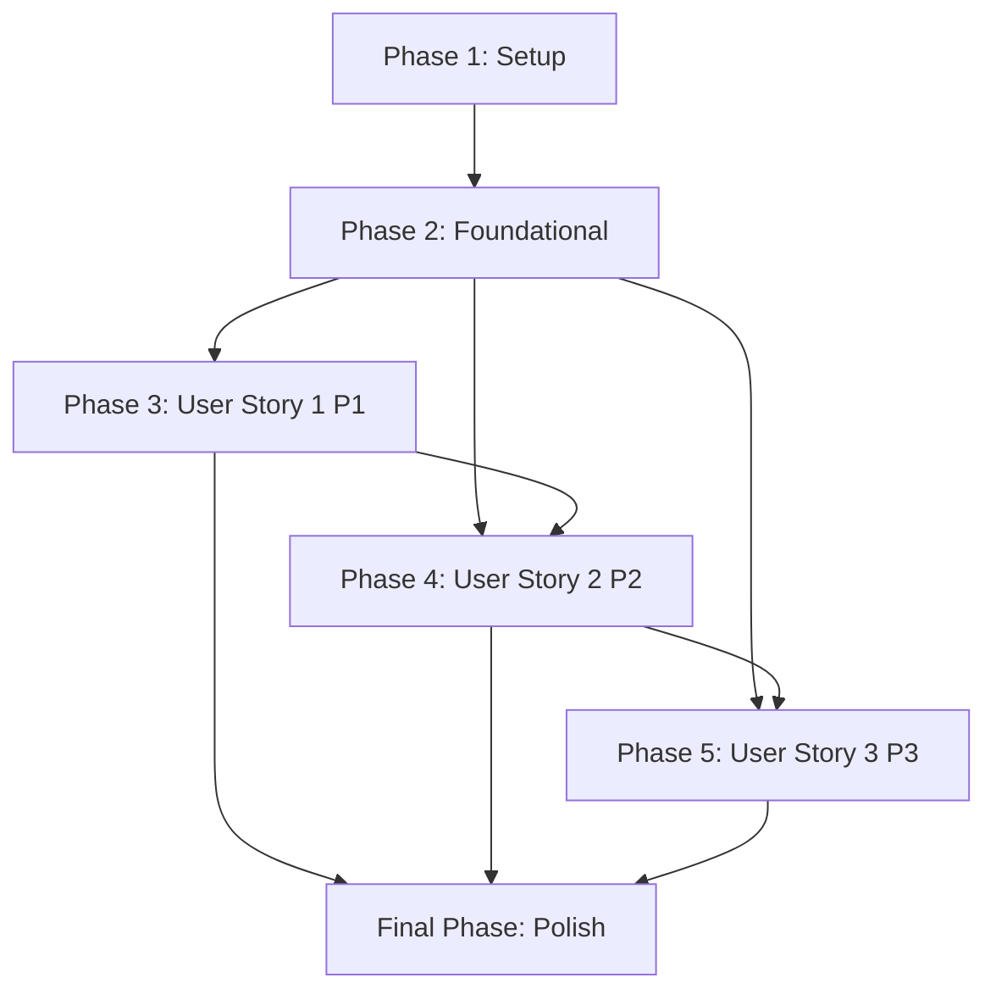

# Implementation Tasks: WalkPaws Platform

**Feature**: WalkPaws Platform | **Branch**: `1-walkpaws-platform` | **Date**: 2025-11-20
**Input**: Implementation Plan, Data Model, API Contracts, Quickstart Guide

**Note**: This task list is generated by the `/speckit.tasks` command. See `.specify/templates/commands/tasks.md` for the execution workflow.

## Summary

Complete implementation of WalkPaws marketplace platform with 3 user stories: P1 (First-time booking), P2 (Recurring walks), P3 (Walker management). Tasks organized by user story with server-first Next.js architecture, Supabase backend, and comprehensive RLS security.

## Implementation Strategy

**MVP Scope**: User Story 1 (First-Time Dog Owner Books a Walk) provides core platform value - user registration, pet profiles, walker discovery, and booking completion.

**Parallel Execution**: Each user story can be implemented independently after foundational setup. Within stories, parallel tasks are marked with [P] for simultaneous development.

**Testing Approach**: Each user story includes independent test criteria. No separate test phase - testing integrated into each story's completion.

## Task Dependencies

## Phase 1: Project Setup

**Goal**: Initialize Next.js project with Supabase integration and development environment

### T001-T010: Core Project Setup

- [ ] T001 Create Next.js 14+ project with TypeScript and App Router in `/`
- [ ] T002 Configure Tailwind CSS with design system tokens in `tailwind.config.js`
- [ ] T003 Set up ESLint and Prettier configuration in `.eslintrc.json` and `.prettierrc`
- [ ] T004 Initialize Git repository with `.gitignore` for Next.js and environment files
- [ ] T005 Create project structure per implementation plan in `app/`, `components/`, `lib/`
- [ ] T006 Set up TypeScript configuration with strict mode in `tsconfig.json`
- [ ] T007 Configure environment variables template in `.env.local.example`
- [ ] T008 Set up package.json with required dependencies (Supabase, React Hook Form, Zod)
- [ ] T009 Create README.md with project overview and setup instructions
- [ ] T010 Configure VS Code settings in `.vscode/settings.json` for consistent development

### T011-T015: Supabase Integration Setup

- [ ] T011 Install and configure Supabase client in `lib/supabase/client.ts`
- [ ] T012 Create Supabase server client in `lib/supabase/server.ts`
- [ ] T013 Set up Supabase environment configuration in `lib/supabase/config.ts`
- [ ] T014 Create database types generator script in `scripts/generate-types.ts`
- [ ] T015 Configure middleware for authentication in `middleware.ts`

## Phase 2: Foundational Components

**Goal**: Build core infrastructure and shared components needed by all user stories

### T016-T025: Core UI Components

- [ ] T016 [P] Create base Button component in `components/ui/Button.tsx`
- [ ] T017 [P] Create Input component with validation in `components/ui/Input.tsx`
- [ ] T018 [P] Create Form component structure in `components/ui/Form.tsx`
- [ ] T019 [P] Create Card component in `components/ui/Card.tsx`
- [ ] T020 [P] Create Navigation components in `components/ui/Navigation.tsx`
- [ ] T021 [P] Create Modal/Dialog component in `components/ui/Modal.tsx`
- [ ] T022 [P] Create Loading states in `components/ui/Loading.tsx`
- [ ] T023 [P] Create Error boundary in `components/ui/ErrorBoundary.tsx`
- [ ] T024 [P] Create Avatar component in `components/ui/Avatar.tsx`
- [ ] T025 [P] Create Badge component in `components/ui/Badge.tsx`

### T026-T035: Authentication Foundation

- [ ] T026 Create authentication context in `lib/auth/context.ts`
- [ ] T027 Implement auth server actions in `app/actions/auth.ts`
- [ ] T027 Create login form component in `components/forms/LoginForm.tsx`
- [ ] T028 Create registration form component in `components/forms/RegisterForm.tsx`
- [ ] T029 Create email verification component in `app/(auth)/verify/page.tsx`
- [ ] T030 Create password reset flow in `app/(auth)/reset-password/page.tsx`
- [ ] T031 Implement protected route wrapper in `components/auth/ProtectedRoute.tsx`
- [ ] T032 Create auth status component in `components/auth/AuthStatus.tsx`
- [ ] T033 Set up auth error handling in `lib/auth/errors.ts`
- [ ] T034 Create auth validation schemas in `lib/auth/schemas.ts`

### T036-T045: Database Foundation

- [ ] T036 Create Supabase project and configure in local environment
- [ ] T037 Apply database schema from data-model.md using Supabase CLI
- [ ] T038 Set up RLS policies for users table in Supabase dashboard
- [ ] T039 Set up RLS policies for pets table in Supabase dashboard
- [ ] T040 Configure storage buckets in Supabase for avatars and photos
- [ ] T041 Set up storage RLS policies for file uploads
- [ ] T042 Create database connection utility in `lib/db/connection.ts`
- [ ] T043 Generate TypeScript types from database in `lib/types/database.ts`
- [ ] T044 Create database error handling in `lib/db/errors.ts`
- [ ] T045 Set up database migration scripts in `scripts/migrations.ts`

### T046-T050: Layout and Navigation

- [ ] T046 Create root layout in `app/layout.tsx` with providers
- [ ] T047 Create authentication layout in `app/(auth)/layout.tsx`
- [ ] T048 Create dashboard layout in `app/(dashboard)/layout.tsx`
- [ ] T049 Create public layout in `app/(public)/layout.tsx`
- [ ] T050 Create navigation component in `components/navigation/Navigation.tsx`

## Phase 3: User Story 1 - First-Time Dog Owner Books a Walk (P1)

**Goal**: Enable new users to register, add pets, browse walkers, and complete their first booking

**Independent Test**: Create account → Add pet → Browse walkers → Book walk → Receive confirmation

### T051-T060: Landing Page and Registration

- [ ] T051 [P] Create landing page hero section in `app/(public)/page.tsx`
- [ ] T052 [P] [US1] Create features section in `app/(public)/page.tsx`
- [ ] T053 [P] [US1] Create testimonials section in `app/(public)/page.tsx`
- [ ] T054 [P] [US1] Create call-to-action section in `app/(public)/page.tsx`
- [ ] T055 [US1] Implement registration flow in `app/(auth)/register/page.tsx`
- [ ] T056 [US1] Create email verification page in `app/(auth)/verify/page.tsx`
- [ ] T057 [US1] Add Google Analytics to landing page in `app/(public)/page.tsx`
- [ ] T058 [US1] Implement SEO meta tags in `app/layout.tsx`
- [ ] T059 [US1] Create responsive navigation for landing page in `components/navigation/LandingNav.tsx`
- [ ] T060 [US1] Add social proof elements in `app/(public)/page.tsx`

### T061-T070: User Profile Creation

- [ ] T061 [US1] Create user profile setup page in `app/(dashboard)/profile/setup/page.tsx`
- [ ] T062 [US1] Create profile form component in `components/forms/ProfileForm.tsx`
- [ ] T063 [US1] Implement profile server actions in `app/actions/profile.ts`
- [ ] T064 [US1] Create avatar upload component in `components/forms/AvatarUpload.tsx`
- [ ] T065 [US1] Add address autocomplete in `components/forms/AddressInput.tsx`
- [ ] T066 [US1] Create profile validation in `lib/profile/schemas.ts`
- [ ] T067 [US1] Implement profile completion progress in `components/profile/ProgressBar.tsx`
- [ ] T068 [US1] Add profile photo cropping in `components/profile/PhotoCropper.tsx`
- [ ] T069 [US1] Create location services in `lib/location/geocoding.ts`
- [ ] T070 [US1] Add phone number validation in `lib/profile/validation.ts`

### T071-T080: Pet Profile Management

- [ ] T071 [US1] Create pet profile form in `components/forms/PetForm.tsx`
- [ ] T072 [US1] Implement pet server actions in `app/actions/pet.ts`
- [ ] T073 [US1] Create pet photo upload in `components/forms/PetPhotoUpload.tsx`
- [ ] T074 [US1] Add breed autocomplete in `components/forms/BreedInput.tsx`
- [ ] T075 [US1] Create pet list component in `components/pet/PetList.tsx`
- [ ] T076 [US1] Implement pet validation in `lib/pet/schemas.ts`
- [ ] T077 [US1] Create pet detail view in `app/(dashboard)/owner/pets/[id]/page.tsx`
- [ ] T078 [US1] Add pet special needs input in `components/forms/SpecialNeedsInput.tsx`
- [ ] T079 [US1] Create pet temperament selector in `components/forms/TemperamentSelect.tsx`
- [ ] T080 [US1] Implement pet walk duration preference in `components/forms/WalkDurationSelect.tsx`

### T081-T090: Walker Discovery

- [ ] T081 [US1] Create walker browse page in `app/(public)/walkers/page.tsx`
- [ ] T082 [US1] Implement walker search filters in `components/walker/WalkerFilters.tsx`
- [ ] T083 [US1] Create walker card component in `components/walker/WalkerCard.tsx`
- [ ] T084 [US1] Build walker list component in `components/walker/WalkerList.tsx`
- [ ] T085 [US1] Create walker detail page in `app/(public)/walkers/[id]/page.tsx`
- [ ] T086 [US1] Implement location-based filtering in `lib/walker/location.ts`
- [ ] T087 [US1] Create rating display component in `components/walker/RatingDisplay.tsx`
- [ ] T088 [US1] Add availability calendar in `components/walker/AvailabilityCalendar.tsx`
- [ ] T089 [US1] Create price display in `components/walker/PriceDisplay.tsx`
- [ ] T090 [US1] Implement walker search in `lib/walker/search.ts`

### T091-T100: Booking Creation

- [ ] T091 [US1] Create booking form in `components/forms/BookingForm.tsx`
- [ ] T092 [US1] Implement booking server actions in `app/actions/booking.ts`
- [ ] T093 [US1] Create date/time picker in `components/forms/DateTimePicker.tsx`
- [ ] T094 [US1] Build booking confirmation in `app/(dashboard)/owner/bookings/confirm/page.tsx`
- [ ] T095 [US1] Create booking summary component in `components/booking/BookingSummary.tsx`
- [ ] T096 [US1] Implement booking validation in `lib/booking/schemas.ts`
- [ ] T097 [US1] Create special instructions input in `components/forms/SpecialInstructions.tsx`
- [ ] T098 [US1] Add booking price calculation in `lib/booking/pricing.ts`
- [ ] T099 [US1] Create booking success page in `app/(dashboard)/owner/bookings/success/page.tsx`
- [ ] T100 [US1] Implement booking conflict detection in `lib/booking/conflicts.ts`

### T101-T110: Booking Status and Notifications

- [ ] T101 [US1] Create booking status tracker in `components/booking/StatusTracker.tsx`
- [ ] T102 [US1] Implement booking notifications in `lib/notifications/booking.ts`
- [ ] T103 [US1] Create owner dashboard in `app/(dashboard)/owner/page.tsx`
- [ ] T104 [US1] Build upcoming walks widget in `components/dashboard/UpcomingWalks.tsx`
- [ ] T105 [US1] Create booking history in `app/(dashboard)/owner/history/page.tsx`
- [ ] T106 [US1] Implement real-time status updates in `lib/realtime/booking.ts`
- [ ] T107 [US1] Create notification bell in `components/notifications/NotificationBell.tsx`
- [ ] T108 [US1] Build notification list in `components/notifications/NotificationList.tsx`
- [ ] T109 [US1] Add email notifications in `lib/email/booking-notifications.ts`
- [ ] T110 [US1] Create booking cancellation flow in `app/actions/booking-cancel.ts`

## Phase 4: User Story 2 - Regular User Manages Ongoing Walks (P2)

**Goal**: Enable existing users to schedule recurring walks and manage their account

**Independent Test**: Login → Schedule recurring walks → Update payment → View walk history

### T111-T120: Dashboard and Recurring Bookings

- [ ] T111 [US2] Enhance owner dashboard in `app/(dashboard)/owner/page.tsx`
- [ ] T112 [US2] Create recurring booking form in `components/forms/RecurringBookingForm.tsx`
- [ ] T113 [US2] Implement recurring booking logic in `lib/booking/recurring.ts`
- [ ] T114 [US2] Create booking management in `app/(dashboard)/owner/bookings/page.tsx`
- [ ] T115 [US2] Build quick booking widget in `components/dashboard/QuickBooking.tsx`
- [ ] T116 [US2] Create walk frequency selector in `components/forms/FrequencySelect.tsx`
- [ ] T117 [US2] Implement recurring booking validation in `lib/booking/recurring-schemas.ts`
- [ ] T118 [US2] Create booking edit functionality in `app/(dashboard)/owner/bookings/[id]/edit/page.tsx`
- [ ] T119 [US2] Add booking rescheduling in `lib/booking/reschedule.ts`
- [ ] T120 [US2] Create booking duplicate feature in `lib/booking/duplicate.ts`

### T121-T130: Payment Management

- [ ] T121 [US2] Create payment methods page in `app/(dashboard)/owner/payment/page.tsx`
- [ ] T122 [US2] Implement payment form in `components/forms/PaymentForm.tsx`
- [ ] T123 [US2] Create payment server actions in `app/actions/payment.ts`
- [ ] T124 [US2] Add payment method validation in `lib/payment/schemas.ts`
- [ ] T125 [US2] Create billing history in `app/(dashboard)/owner/billing/page.tsx`
- [ ] T126 [US2] Implement payment security in `lib/payment/security.ts`
- [ ] T127 [US2] Create payment notifications in `lib/notifications/payment.ts`
- [ ] T128 [US2] Add payment method management in `components/payment/PaymentMethods.tsx`
- [ ] T129 [US2] Create invoice download in `lib/payment/invoices.ts`
- [ ] T130 [US2] Implement subscription management in `lib/payment/subscriptions.ts`

### T131-T140: Walk History and Analytics

- [ ] T131 [US2] Create walk history page in `app/(dashboard)/owner/history/page.tsx`
- [ ] T132 [US2] Build walk report viewer in `components/walk/WalkReportViewer.tsx`
- [ ] T133 [US2] Create walk photo gallery in `components/walk/PhotoGallery.tsx`
- [ ] T134 [US2] Implement walk statistics in `lib/analytics/walks.ts`
- [ ] T135 [US2] Create walker rating system in `components/walker/WalkerRating.tsx`
- [ ] T136 [US2] Build review submission in `components/review/ReviewForm.tsx`
- [ ] T137 [US2] Create review management in `app/(dashboard)/owner/reviews/page.tsx`
- [ ] T138 [US2] Add walk calendar view in `components/dashboard/WalkCalendar.tsx`
- [ ] T139 [US2] Create spending analytics in `components/analytics/SpendingChart.tsx`
- [ ] T140 [US2] Implement favorite walkers in `lib/walker/favorites.ts`

## Phase 5: User Story 3 - Dog Walker Manages Their Schedule (P3)

**Goal**: Enable walkers to manage their profiles, availability, and bookings

**Independent Test**: Create walker profile → Set availability → Accept/decline bookings → Submit walk reports

### T141-T150: Walker Profile Setup

- [ ] T141 [US3] Create walker registration flow in `app/(auth)/walker/register/page.tsx`
- [ ] T142 [US3] Build walker profile form in `components/forms/WalkerProfileForm.tsx`
- [ ] T143 [US3] Create walker verification upload in `components/forms/DocumentUpload.tsx`
- [ ] T144 [US3] Implement walker server actions in `app/actions/walker.ts`
- [ ] T145 [US3] Create walker dashboard in `app/(dashboard)/walker/page.tsx`
- [ ] US3 Create walker bio editor in `components/walker/BioEditor.tsx`
- [ ] T147 [US3] Build services offered selector in `components/walker/ServicesSelect.tsx`
- [ ] T148 [US3] Create pricing configuration in `components/walker/PricingConfig.tsx`
- [ ] T149 [US3] Implement radius settings in `components/walker/RadiusConfig.tsx`
- [ ] T150 [US3] Create walker validation in `lib/walker/schemas.ts`

### T151-T160: Availability Management

- [ ] T151 [US3] Create availability calendar in `components/walker/AvailabilityCalendar.tsx`
- [ ] T152 [US3] Implement availability server actions in `app/actions/availability.ts`
- [ ] T153 [US3] Build recurring availability in `lib/walker/recurring-availability.ts`
- [ ] T154 [US3] Create time slot manager in `components/walker/TimeSlotManager.tsx`
- [ ] T155 [US3] Implement availability conflicts in `lib/walker/availability-conflicts.ts`
- [ ] T156 [US3] Create availability templates in `components/walker/AvailabilityTemplates.tsx`
- [ ] T157 [US3] Add availability export in `lib/walker/export-availability.ts`
- [ ] T158 [US3] Create holiday calendar in `components/walker/HolidayCalendar.tsx`
- [ ] T159 [US3] Implement availability notifications in `lib/notifications/availability.ts`
- [ ] T160 [US3] Create availability analytics in `components/walker/AvailabilityAnalytics.tsx`

### T161-T170: Booking Management for Walkers

- [ ] T161 [US3] Create walker booking inbox in `app/(dashboard)/walker/bookings/page.tsx`
- [ ] T162 [US3] Build booking request card in `components/walker/BookingRequestCard.tsx`
- [ ] T163 [US3] Create booking accept/decline flow in `app/actions/walker-booking.ts`
- [ ] T164 [US3] Implement booking negotiation in `lib/booking/negotiation.ts`
- [ ] T165 [US3] Create booking calendar view in `components/walker/BookingCalendar.tsx`
- [ ] T166 [US3] Build walk completion form in `components/walker/WalkCompletionForm.tsx`
- [ ] T167 [US3] Create walk report submission in `app/actions/walk-report.ts`
- [ ] T168 [US3] Implement walk photo upload in `components/walker/WalkPhotoUpload.tsx`
- [ ] T169 [US3] Create route tracking in `lib/walker/route-tracking.ts`
- [ ] T170 [US3] Build walk statistics in `components/walker/WalkStatistics.tsx`

## Final Phase: Polish & Cross-Cutting Concerns

**Goal**: Production readiness, performance optimization, and comprehensive testing

### T171-T185: Performance and Optimization

- [ ] T171 [P] Implement image optimization in `lib/images/optimization.ts`
- [ ] T172 [P] Add lazy loading for images in `components/ui/LazyImage.tsx`
- [ ] T173 [P] Create loading skeletons in `components/ui/Skeleton.tsx`
- [ ] T174 [P] Implement caching strategies in `lib/cache/strategies.ts`
- [ ] T175 [P] Add performance monitoring in `lib/analytics/performance.ts`
- [ ] T176 [P] Optimize database queries in `lib/db/optimization.ts`
- [ ] T177 [P] Implement connection pooling in `lib/db/pooling.ts`
- [ ] T178 [P] Add CDN configuration in `next.config.js`
- [ ] T179 [P] Create error tracking in `lib/errors/tracking.ts`
- [ ] T180 [P] Implement rate limiting in `lib/security/rate-limit.ts`
- [ ] T181 [P] Add security headers in `next.config.js`
- [ ] T182 [P] Create backup procedures in `scripts/backup.ts`
- [ ] T183 [P] Implement monitoring alerts in `lib/monitoring/alerts.ts`
- [ ] T184 [P] Add health checks in `app/api/health/route.ts`
- [ ] T185 Create deployment checklist in `docs/deployment-checklist.md`

### T186-T195: Accessibility and Internationalization

- [ ] T186 [P] Implement full WCAG 2.1 AA compliance audit in `docs/accessibility-audit.md`
- [ ] T187 [P] Add keyboard navigation in `lib/accessibility/keyboard.ts`
- [ ] T188 [P] Create screen reader support in `lib/accessibility/screen-reader.ts`
- [ ] T189 [P] Implement color contrast checking in `lib/accessibility/contrast.ts`
- [ ] T190 [P] Add focus management in `lib/accessibility/focus.ts`
- [ ] T191 [P] Create ARIA labels system in `lib/accessibility/aria.ts`
- [ ] T192 [P] Add alternative text validation in `lib/accessibility/alt-text.ts`
- [ ] T193 [P] Implement responsive design testing in `tests/responsive.test.ts`
- [ ] T194 [P] Create mobile-first components in `components/mobile/`
- [ ] T195 Add accessibility testing in `tests/accessibility.test.ts`

### T196-T200: Documentation and Deployment

- [ ] T196 Create API documentation in `docs/api/README.md`
- [ ] T197 Write deployment guide in `docs/deployment.md`
- [ ] T198 Create user documentation in `docs/user-guide.md`
- [ ] T199 Write walker onboarding guide in `docs/walker-onboarding.md`
- [ ] T200 Finalize production deployment in `vercel.json`

## Task Execution Order

### Parallel Execution Opportunities

**Within Phase 1**: All setup tasks (T001-T015) can be executed in parallel by different team members

**Within Phase 2**: UI components (T016-T025), Auth (T026-T035), Database (T036-T045), Layout (T046-T050) can be parallelized

**Within User Stories**:
- US1: Landing page sections (T051-T054), Pet forms (T071-T080), Walker discovery (T081-T090) can be parallel
- US2: Payment (T121-T130) and History (T131-T140) can be developed in parallel
- US3: Profile (T141-T150), Availability (T151-T160), and Booking management (T161-T170) can be parallel

**Final Phase**: All polish tasks (T171-T200) marked with [P] can be executed in parallel

### Story Dependencies

1. **User Story 1 (P1)** → **User Story 2 (P2)**: US2 requires user accounts and basic booking functionality from US1
2. **User Story 1 (P1)** → **User Story 3 (P3)**: US3 requires user authentication and basic platform functionality
3. **User Story 2 (P2)** → **Final Phase**: Polish tasks should be done after all core functionality

### MVP Implementation Path

For MVP focusing on User Story 1 only:
- Complete Phase 1 (Setup)
- Complete Phase 2 (Foundational)
- Complete Phase 3 (User Story 1)
- Complete performance and security tasks from Final Phase (T171-T185)

This provides core booking functionality for immediate user value.

## Success Metrics

- **Phase 1**: Development environment fully functional
- **Phase 2**: All core components working, database accessible
- **Phase 3**: New user can complete full booking flow in under 10 minutes
- **Phase 4**: Existing user can manage recurring walks efficiently
- **Phase 5**: Walker can manage schedule and complete walks professionally
- **Final Phase**: Platform meets performance, security, and accessibility standards

## Risk Mitigation

- **Database Schema Changes**: Use migrations and version control
- **Authentication Issues**: Implement proper error handling and fallback flows
- **Performance Problems**: Regular testing and optimization throughout development
- **Security Vulnerabilities**: Follow security checklist and conduct audits
- **User Experience Issues**: Regular usability testing and feedback collection

---

**Total Tasks**: 200
**User Story 1 Tasks**: 60
**User Story 2 Tasks**: 30
**User Story 3 Tasks**: 30
**Setup/Foundational Tasks**: 50
**Polish Tasks**: 30

**Next Step**: Execute implementation with `/speckit.implement` command, starting with Phase 1 tasks.